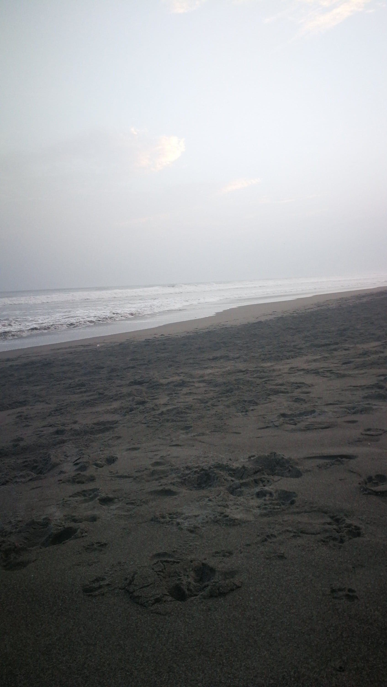

Los besos son más esperados
si tienen segunda (p)arte.

Las estrellas tintinean
cuando hablo de (am)arte
y las olas se silencian
cuando me dispongo a (recit)arte.

Los viajes son más cortos

si espero (acarici)arte.

Las noches son menos frías
si puedo (bes)arte.

La locura es más bonita

si se (comp)arte.

Las cosquillas más sentidas

si buscan (abraz)arte.

Mis ideas se revuelven
cuando voy a (habl)arte
y me tiemblan las piernas
cuando intento (toc)arte.

Tus oídos son más sensibles
si puedo (regal)arte
versos a medio hacer
donde (cont)arte
mis planes de huir contigo
a un mundo nuevo donde (entreg)arte
los pinceles para que nos pintes
de Leona y Lobo (tortuga (ap)arte),
nos vuelvas inmortales y, bajo el amanecer,
nos conviertas en arte.
