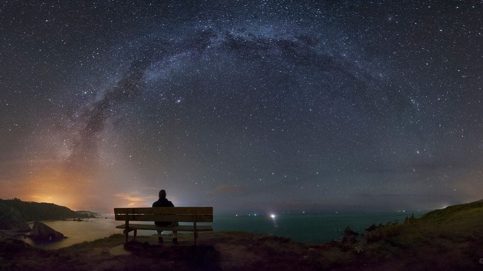

En la lejanía
el viento nos susurraba
que el mundo seguía ardiendo,
pero ya no importaba.

En aquel páramo
de raíces y cemento
habíamos plantado nuestra bandera
reclamándolo durante el tiempo
que tardasen nuestros ojos
en aclarar sus sentimientos.

La Luna nos evitaba
quizá por vergüenza
o quizá por celos
de que nosotros al fin
pudiésemos vernos.

El frío hizo temblar tus piernas
y tus labios las mías
cuando, decidida,
recorriste la distancia
entre la promesa y la fechoría
de robarme el aliento con ese beso
que una promesa tenía prendida.

A cambio solo pude darte
un pedazo de mis sueños
y una torpe sonrisa
mientras tú me mirabas sorprendida.

Un corazón lleno de cicatrices,
desertor de batallas perdidas,
frente a la inocencia de unos labios
que buscan tímidos su compañía.

De pronto la temperatura
ya no era tan hostil
y aquel banco en medio de la nada
se tornó refugio alejado de un mundo ruin.

Parecía extraño pensar
que la ciudad, lejos, seguía rugiendo,
que el planeta seguía enfermo
y que en algún lugar
aún existía la soledad.

Sin querer
habíamos creado una utopía,
intentando escapar, por un momento,
de aquella realidad.

Y en aquel lugar, frío y desolado,
olvidado por aquellos
que algún día lo crearon
comenzaron a brotar flores
cada vez que besabas mis labios,
cada vez que te fundías en mis brazos,
cada vez que nos recordábamos
que seguíamos siendo humanos.

Mientras tanto,
en nuestro inconsciente,
aquel recóndito rincón de la urbe
perdió el sobrenombre de "páramo"
porque ahora,
bendito por todo aquello
que con tanto celo
nos habíamos guardado,
pasó de ser un cualquiera,
a ser un lugar para querernos,
a ser un lugar para amarnos,
a ser un páramo, sí,
pero al fin y al cabo,
"nuestro páramo".

Imagen de Daniel Caxete
