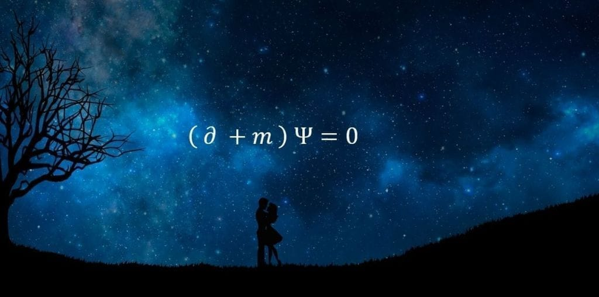

Qué fácil quererte.

Qué difícil verte
y no poder tocarte.

Qué fácil mirarte
y querer tenerte cerca
haciendo de unos brazos
un lugar donde refugiarse.

Qué difícil ver tus labios
y no poder besarte,
ver tu piel
y no poder acariciarte,
sentir tu amor
y no estar ahí para abrazarte.

Te siento cerca
y a la vez tan lejos.

Un espacio indeterminado
que se torna complejo,
pues te tengo a veinte centímetros,
pero no te alcanzan mis besos.

Mi paciencia comparte cama
con la inmediatez y mis nervios
discutiendo si 5 meses
son fugaces o eternos
en una eterna disputa
donde la razón solo la tiene el tiempo.

Mi cordura se escapa
cuando por las noches
hablo con tu fotografía
cierro los ojos con fuerza
y creo sentir tu roce.

Un diálogo espontáneo
disfrazado de soliloquio
en que te cuento mis miedos,
te hablo de mis sueños
y construyo un nosotros.

No estás aquí
pero te siento.

Te susurro que me encantas,
que cuando me besas tiemblo,
que vivo esperando
tu próximo "Te quiero".

Te siento aquí
pero no estás.

Mantengo mi corazón caliente
para que puedas refugiarte en él
del frío de diciembre.

Estás aquí
pero a la vez no.

Te siento cerca
pero estás lejos.

No olvides que te amo,
que te echo de menos
y que pasen dos o cinco meses
aquí te espero.

Te quiero.
