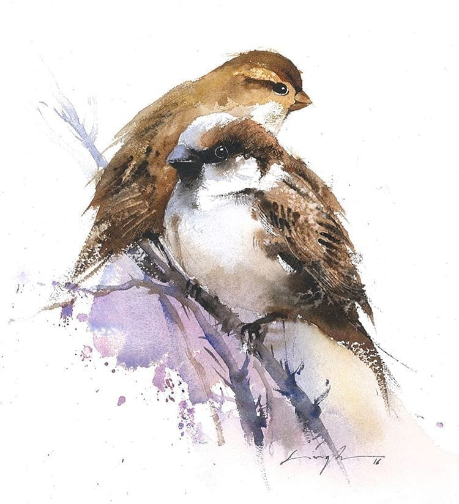

Hoy has vuelto.
Baluarte de mi niñez,
gorrión eterno.

Hoy mi subconsciente
ha querido homenajearte
en un sueño.

Los años han seguido corriendo
contra todo pronóstico
y ya no los cuento.

El silencio
dejado por tus silbidos
y tus canciones repetidas
aún retumba en estos pasillos.
Como si aún estuvieses.
Cómo si nunca te hubieras ido.

No te olvido
pero evito recordarte.
Sigo tu legado
cuidando de la abuela,
que nada le falte.

¿Querrías ver el desastre
en que el mundo ha tornado?

El pequeño sabe tu nombre,
te conoce aunque no te recuerde,
quizá nunca llegue a escuchar
todas tus historias,
tener tu cariño,
recibir tus abrazos.

A mí no me va mal.
Sigo resiliente.
Lloro menos de lo que debería
y solo escribo los martes trece.
Pero no nos engañemos,
sabes que me busco la vida
y que siempre renegué de la suerte.

Aún te llevo muy dentro.
Abuelo, aún me duele.

Pero hoy has vuelto.
He oído de nuevo una voz
qué creía olvidada,
y cuando casi alcancé tu cara
volví a caer despierto.

Te sigo echando de menos.
Baluarte de mi infancia,
gorrión eterno.

Imagen de Nitin Singh
