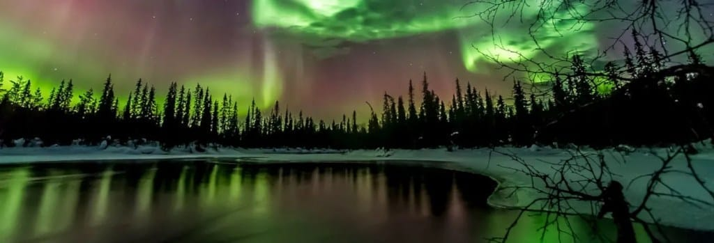

Luz blanquecina
atraviesa una ventana
exhausta de mantener separados
el exterior bajo cero
de los 37 grados
de nuestro lado de la cama.

Encerrados entre los límites
de un colchón de 90 centímetros
dos cuerpos buscan refugio
lejos de un mundo incomprensible y frío.

Despierto para descubrir
que aún sigues dormida
y en silencio doy las gracias
porque aparecieses en mi vida.

Entre las sábanas
acaricio tu cara
y me aproximo a oler tu pelo
mientras te oigo respirar
y observo de tu nariz el aleteo.

Me pregunto qué sueñas,
qué piensas cuando me miras
y tornas risueña,
si piensas en el futuro
cada vez que me besas,
si también te sientes
indestructible e indefensa,
si esta noche habré vuelto a roncar
o me habré quedado dormido
aplastándote con mi pierna
hasta que hayas tenido que moverme
con la dulzura con la que mueve
la brisa a la arena
y con el cariño con que la Luna
consiente a las estrellas.

Anoche, en Laponia,
el cielo se iluminó.
Quizá fueran falsas auroras,
creadas por focos.
Quizá fuera real.
Quizá fuera un sueño.
Quizá fueran tus ojos.

De pronto coges aire
llenándote de vida
y lo sueltas, con cuidado,
acariciando mis costillas.

Abres los ojos.

Te miro y me miras.

Sonríes y sonrío.

Buenos días.
